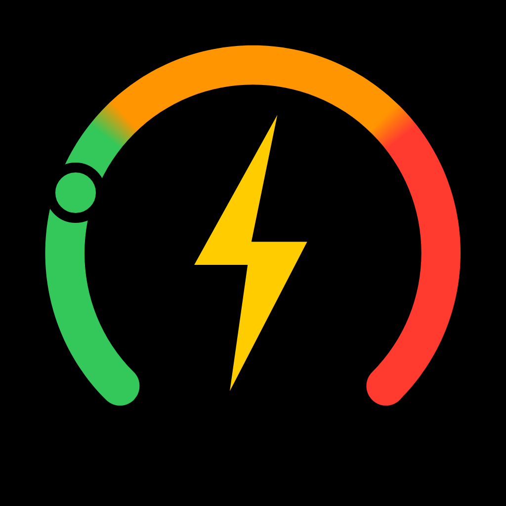

<h1 align="center">EPWatch macOS</h1>

App displaying the current electricity price,  with widgets for macOS.

 

## About
This is a fork of [EPWatch](https://github.com/jonkan/EPWatch) with the aim to provide the same app but for macOS. 

## Download

## Supported countries

The app uses the [Day-ahead Prices](https://transparency.entsoe.eu/transmission-domain/r2/dayAheadPrices/show) from the [ENTSO-E Transparency Platform](https://transparency.entsoe.eu/).

* Supported countries:

Austria, Belgium, Bulgaria, Croatia, Czech Republic, Denmark, Estonia, Finland, France, Germany, Greece, Hungary, Ireland, Italy, Latvia, Lithuania, Luxembourg, Netherlands, Norway, Poland, Portugal, Romania, Serbia, Slovakia, Slovenia, Spain, Sweden, Switzerland, Ukraine.

* Unsupported countries (no data):

Albania, Bosnia and Herzegovina, Cyprus, Georgia, Kosovo, Malta, Moldova, Montenegro, North Macedonia, Turkey, United Kingdom.

## Build

-   Obtain an API token from https://transparency.entsoe.eu (you need to email them).
-   Place token into a `.security_token` file in the root of the project.
-   Hit Build & Run

## Resources

-   [Transparency Platform RESTful API - user guide](https://transparency.entsoe.eu/content/static_content/Static%20content/web%20api/Guide.html)

## Credits
- Jonas Bromö (Original EPWatch Author)

